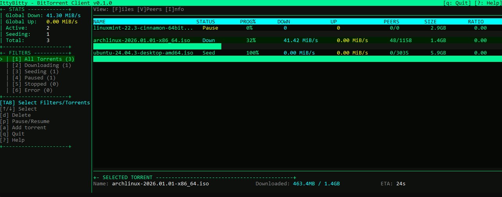

# IttyBitty



A cross-platform, terminal-based BitTorrent client written in Rust. Built on `ratatui` (TUI) and `librqbit` (BitTorrent engine).

## Features

- Terminal GUI with progress bars and color status
- Magnet/URL/path add flow with file selection
- Per-torrent download directory (with automatic subfolder creation)
- Pause/Resume, Delete with confirmation
- Filters: All / Downloading / Seeding / Paused / Error
- Persistence enabled via rqbit session persistence

## Requirements

- Rust (stable)
- Cargo

## Run it by

```bash
cargo run
```

## Key bindings

Main
- [TAB] Select Filters/Torrents
- [Up/Down] Select item
- [a] Add torrent (magnet/URL/path)
- [p] Pause/Resume
- [d] Delete
- [q] Quit (confirm)
- [?] Help (scrollable)

Help scroll
- Up/Down (or k/j)
- ? / x / Esc to close

Confirm dialogs
- [Y]es / [N]o selects
- Left/Right selects (h/l also work)
- Enter confirms
- Esc cancels

## Add flow

1. Press [a] to open the add dialog.
2. Paste a magnet, URL, or local `.torrent` path and press Enter.
3. Choose the download directory (Enter uses the default).
4. A subfolder is created using the torrent name (or first file name).
   - If the folder already exists, add fails to avoid accidental overwrite.
5. Select files and press Enter to start.

## Paste behavior

Paste is accepted only inside the add/dir dialogs to avoid accidental commands in the main UI.

## Notes

- Duplicate handling: the same torrent (info-hash) can be added to different base paths; adding to the same path is an error.
- This is an early preview; expect UI/UX to evolve.

## Contributing

Open source - contributions are highly appreciated. Feel free to open issues or pull requests.

## License

BSD 3-Clause License. See `LICENSE`.

